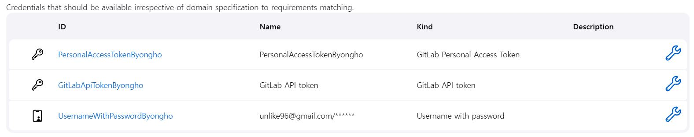
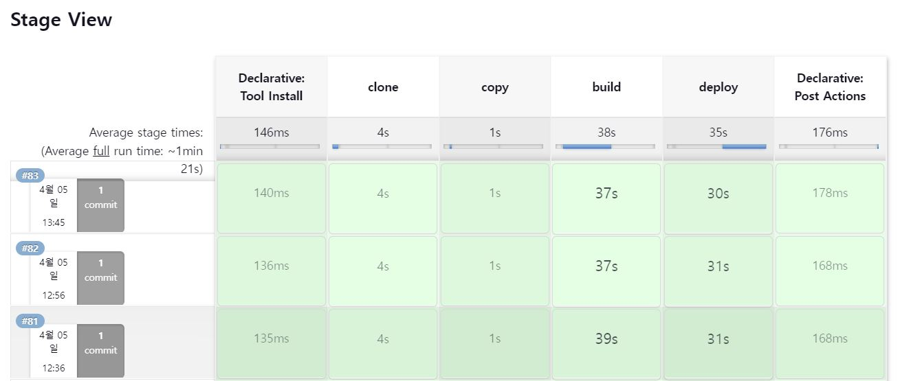
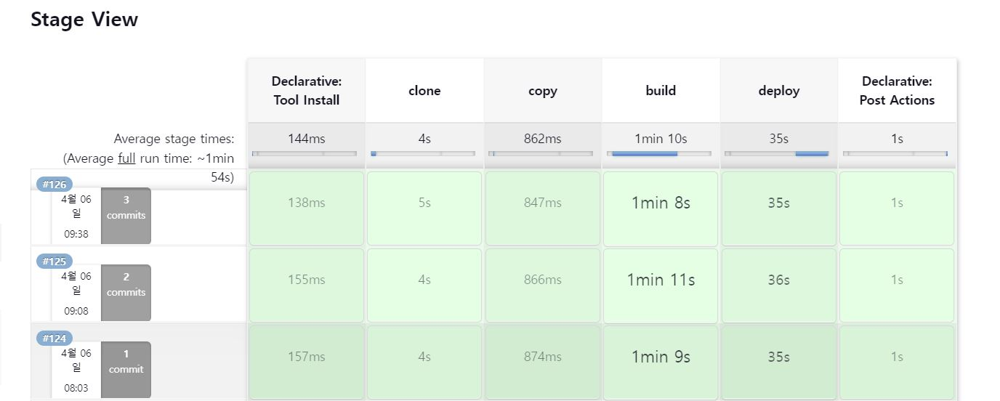

# 배포

# 1. EC2 설정

## 1.1. 초기 설정

- **기본 패키지 업데이트**
  ```bash
  sudo apt-get update
  ```
- **필요 패키지 설치**
  ```bash
  sudo apt-get install \
    ca-certificates \
    curl \
    gnupg \
    vim \
    lsb-release
  ```

## 1.2. 도커 설치

[도커 공식문서](https://docs.docker.com/engine/install/ubuntu/#install-using-the-repository)를 따라 설치.

- **Docker GPG Key 등록**
  ```bash
  sudo mkdir -m 0755 -p /etc/apt/keyrings
  curl -fsSL https://download.docker.com/linux/ubuntu/gpg | sudo gpg --dearmor -o /etc/apt/keyrings/docker.gpg
  ```
- **Stable Repository 등록**
  ```bash
  echo \
    "deb [arch=$(dpkg --print-architecture) signed-by=/etc/apt/keyrings/docker.gpg] https://download.docker.com/linux/ubuntu \
    $(lsb_release -cs) stable" | sudo tee /etc/apt/sources.list.d/docker.list > /dev/null
  ```
- **Docker Engine 설치**
  ```bash
  sudo apt-get update
  ```
  ```bash
  sudo apt-get install docker-ce docker-ce-cli containerd.io
  ```

## 1.3. 도커 컴포즈 설치

[도커 공식문서](https://docs.docker.com/engine/install/ubuntu/#install-using-the-repository)를 따라 설치. 처음에 Compose V2 으로 설치해서 배포를 진행하였지만, 명령어를 인식하지는 오류가 발생하여 V1으로 재설치하여 진행했습니다.

- **CLI 플러그인 설치**
  ```bash
  DOCKER_CONFIG=${DOCKER_CONFIG:-$HOME/.docker}
  mkdir -p $DOCKER_CONFIG/cli-plugins
  curl -SL https://github.com/docker/compose/releases/download/v2.17.2/docker-compose-linux-x86_64 -o $DOCKER_CONFIG/cli-plugins/docker-compose
  ```
- **설치파일 실행권한 추가**
  ```bash
  chmod +x $DOCKER_CONFIG/cli-plugins/docker-compose
  ```

# 2. Nginx 설정

## 2.1. Nginx 설치

- **Nginx 설치**
  ```bash
  apt-get install nginx
  ```
- **Nginx 설치 확인**
  ```bash
  nginx -v
  ```

## 2.2. SSL 인증서

- **letsencrypt 설치**
  ```bash
  apt-get install letsencrypt
  ```
- **SSL 인증서 발급**
  ```bash
  letsencrypt certonly --standalone -d [도메인주소]
  ```
- **SSL 인증서 발급 확인**

  ```bash
  cd /etc/letsencrypt/live/[도메인]
  ls
  ```

- **SSL 인증서 nginx 적용**  
  sites-available 폴더에 들어가 프로젝트 메인 .conf 파일을 만든다.

  ```bash
  cd /etc/nginx/sites-available/
  vim [파일명].conf
  ```

  다음과 같은 형식으로 .conf 파일을 작성한다.

  ```nginx
  # http 요청을 https 요청으로 리다이렉트
  server {
  	listen 80;
  	server_name [도메인 네임];
  	return 301 https://$server_name$request_uri;
  }

  server {
  	listen 443 ssl;
  	server_name [도메인 네임];

  	ssl_certificate /etc/nginx/ssl/example.crt;
  	ssl_certification_key /etc/nginx/ssl/example.key;

  	...
  }
  ```

  작성한 프로젝트의 메인 .conf파일을 sites-enabled 폴더에 소프트링크를 생성하여 등록한다.

  ```bash
  ln -s /etc/nginx/sites-available/[파일명].conf /etc/nginx/sites-enabled/[파일명].conf
  ```

## 2.4. Nginx 도커 설치

처음에는 호스트 EC2에 직접 Nginx를 설치하여 사용하려고 했으나, 이후 블루-그린 포트 방식의 배포를 구현하면서 Jenkis 도커 내부에서 호스트에 설치된 Nginx를 재시작(reload)할 수 없는 문제가 발생했고, 이를 해결하기 위해 Nginx 도커를 추가로 설치하여 Jenkins 도커로부터 Nginx 도커로 명령어를 전달하는 방식을 대안으로 채택했습니다. 또한, 그 과정에서 앞서 셋팅한 Nginx 설정을 유지하기 위해 바인드 마운트하여 도커를 실행했습니다.

```bash
docker run -d -p 80:80 -p443:443 -v /etc/nginx:/etc/nginx -v /etc/letsencrypt:/etc/letsencrypt -u root --name [컨테이너 이름] nginx
```

# 3. Jenkins 설정

## 3.1. Jenkins 도커 설치

- **Jenkins 이미지 다운로드**
  ```bash
  docker pull jenkins/jenkins:lts
  ```
- **다운로드 확인**
  ```bash
  docker images
  ```
- **Jenkins 도커 실행**  
  Jenkins 변수, 도커, 도커 컴포즈, Nginx 관련 디렉토리들을 바인드 마운트 해줍니다.
  ```bash
  docker run -d -p 8080:8080 -p 50000:50000 -v /usr/bin/docker:/usr/bin/docker -v /home/jenkins:/var/jenkins_home -v /var/run/docker.sock:/var/run/docker.sock -v /usr/bin/docker-compose:/usr/bin/docker-compose -v /etc/nginx:/etc/nginx -u root --name [컨테이너 이름] jenkins/jenkins:lts
  ```

## 3.2. 추가 Plugin 설치

Jenkins 첫 로그인 시, 나타나는 화면에 나타나는 Recommended Plugins 외에도 다음 플러그인들을 추가 설치했습니다.

```bash
Bitbucket Pipeline for Blue Ocean

Dashboard for Blue Ocean

Personalization for Blue Ocean

Display URL for Blue Ocean

Server Sent Events (SSE) Gateway

Events API for Blue Ocean

Blue Ocean Pipeline Editor

i18n for Blue Ocean

Autofavorite for Blue Ocean

Blue Ocean

NodeJS

GitLab

Gitlab Authentication

Gitlab API

Gitlab Branch Source

Gitlab Merge Request Builder

Generic Webhook Trigger

Config File Provider

Docker

Docker Pipeline

docker-build-step
```

## 3.3. Credentials 설정

Gitlab 프로젝트에 접근하기 위해 다음과 같이 3가지의 credentials를 설정했습니다.  
GitLab Personal Access Token과 GitLab API token은 모두 GitLab에서 개인 프로필의 Personal Access Token을 발급받아 등록하였고, Username with password는 GitLab 개인 계정 아이디와 비밀번호를 등록하였습니다.  


# 4. 백엔드 배포

## 4.1. 도커 파일 작성

### 4.1.1. 메인 SpringBoot 서버

```Dockerfile
# JAVA Version
# alpine is light than JDK only but alpine only supported sh scripts not bash script
FROM openjdk:11

# Define argument using ARG
# Setting your path which located .jar file
ARG JAR_FILE_PATH=build/libs/[앱 이름]-0.0.1-SNAPSHOT.jar

# Copy .jar to app.jar
COPY $JAR_FILE_PATH app.jar

# Execute Command in container
ENTRYPOINT java -jar /app.jar --server.port=8200

```

### 4.1.2. AI SpringBoot 서버

```Dockerfile
# JAVA Version
# alpine is light than JDK only but alpine only supported sh scripts not bash script
FROM openjdk:11

# Define argument using ARG
# Setting your path which located .jar file
ARG JAR_FILE_PATH=build/libs/[앱 이름]-0.0.1-SNAPSHOT.jar

# Copy .jar to app.jar
COPY $JAR_FILE_PATH app.jar

# Execute Command in container
ENTRYPOINT java -jar /app.jar --server.port=8000

```

### 4.1.3. AI FastAPI 서버

```Dockerfile
# Start from the official Python base image.
FROM python:3.9

# Set the current working directory to /code.
WORKDIR /code

# Copy the file with the requirements to the /code directory.
COPY ./requirements.txt /code/requirements.txt

# Install the package dependencies in the requirements file.
RUN pip install --no-cache-dir --upgrade -r /code/requirements.txt

# Copy the ./app directory inside the /code directory.
COPY ./app /code/app

# libGL 모듈 관련 우분투에서 발생하는 오류로, 추가 설치해야하는 라이브러리
RUN apt-get update
RUN apt-get -y install libgl1-mesa-glx

# Set the command to run the uvicorn server.
CMD ["uvicorn", "app.main:app", "--host", "0.0.0.0", "--port", "9000"]
```

## 4.2. docker-compose.yml 작성

블루-그린 방식의 배포를 위해 다음과 같이 이미지, 컨테이너, 외부 포트번호가 다른 두가지의 docker-compose 파일을 작성하였습니다.

- **docker-compose.blue.yaml**

  ```yml
  # 도커 버전에 따라 대응하는 버전으로 설정
  version: '3.6'

  services:
    doeng:
      build:
        context: [메인 SpringBoot Dockerfile 위치]
      image: doeng-springboot-image-blue
      container_name: doeng-springboot-blue
      ports:
        - '8200:8200'
    doengFlux:
      build:
        context: [AI SpringBoot Dockerfile 위치]
      image: doeng-flux-image-blue
      container_name: doeng-flux-blue
      ports:
        - '8000:8000'
    doengAi:
      build:
        context: [AI fastAPI Dockerfile 위치]
      image: doeng-ai-image-blue
      container_name: doeng-ai-blue
      ports:
        - '9000:9000'
  ```

- **docker-compose.green.yaml**

  ```yml
  # 도커 버전에 따라 대응하는 버전으로 설정
  version: '3.6'

  services:
    doeng:
      build:
        context: [메인 SpringBoot Dockerfile 위치]
      image: doeng-springboot-image-blue
      container_name: doeng-springboot-blue
      ports:
        - '8201:8200'
    doengFlux:
      build:
        context: [AI SpringBoot Dockerfile 위치]
      image: doeng-flux-image-blue
      container_name: doeng-flux-blue
      ports:
        - '8001:8000'
    doengAi:
      build:
        context: [AI fastAPI Dockerfile 위치]
      image: doeng-ai-image-blue
      container_name: doeng-ai-blue
      ports:
        - '9001:9000'
  ```

## 4.3. Nginx 설정 파일

### 4.3.1. proxy pass 설정

먼저 sites-available 폴더에 들어가 프로젝트 메인 .conf 파일에, 다음과 같이 백엔드 관련해서 프록싱할 url 엔드포인트를 추가해줍니다. 이 때 프록싱할 실제 주소는 아래 '블루 그린 서버 주소 설정'에서 upstream으로 설정해줍니다.

```nginx
...

server {
  listen 443 ssl;
  server_name [도메인 네임];

  ssl_certificate /etc/nginx/ssl/example.crt;
  ssl_certification_key /etc/nginx/ssl/example.key;

      location /api {
            proxy_pass http://doeng_spring;
            proxy_set_header HOST $host;
            proxy_set_header X-Real-IP $remote_addr;
      }
      location /game {
              proxy_pass http://doeng_flux;
              proxy_set_header HOST $host;
              proxy_set_header X-Real-IP $remote_addr;
      }
      location /analyze {
              proxy_pass http://doeng_ai;
              proxy_set_header HOST $host;
              proxy_set_header X-Real-IP $remote_addr;
      }
      ...
}
```

### 4.3.2. 블루 그린 서버 주소 설정

sites-available 폴더에 블루 컨테이너와 그린 컨테이너에 각각 대응하는 url 주소를 가진 .conf 파일을 2개 작성하였습니다.

- **doneg-back-blue.conf**

  ```nginx
  upstream doeng_spring {
        server j8a601.p.ssafy.io:8200;
  }
  upstream doeng_flux {
          server j8a601.p.ssafy.io:8000;
  }
  upstream doeng_ai {
          server j8a601.p.ssafy.io:9000;
  }
  ```

- **doneg-back-green**
  ```nginx
  upstream doeng_spring {
        server j8a601.p.ssafy.io:8201;
  }
  upstream doeng_flux {
          server j8a601.p.ssafy.io:8001;
  }
  upstream doeng_ai {
          server j8a601.p.ssafy.io:9001;
  }
  ```

## 4.4. 쉘스크립트 파일 작성

현재 실행중인 도커 컴포즈의 종류(블루 or 그린)를 파악하고, 그에 따라 이번에 실행시켜야할 도커 컴포즈 파일을 결정하는 기능을 담은 쉘스크립트 파일을 만들었습니다. 실제 이후 Jenkins에서 실행시키는 것은 이 쉘 스크립트 파일입니다.

```sh
#!/bin/bash

# Get the current active version
pwd
EXIST_BLUE=$(docker-compose -p [도커 컴포즈 프로젝트 이름]-blue -f docker-compose.blue.yaml ps | grep Up)

# Set the new version to deploy
if [ -n "$EXIST_BLUE" ]; then
  CURRENT_VERSION="blue"
  NEW_VERSION="green"
else
  CURRENT_VERSION="green"
  NEW_VERSION="blue"
fi

# 새 도커 컴포즈 시작
docker-compose -p [백엔드 도커 컴포즈 프로젝트 이름]-$NEW_VERSION -f docker-compose.$NEW_VERSION.yaml up -d

sleep 10

# Check the new version
EXIST_AFTER=$(docker-compose -p [백엔드 도커 컴포즈 프로젝트 이름]-$NEW_VERSION -f docker-compose.$NEW_VERSION.yaml ps | grep Up)

# Switch traffic to the new version
if [ -n "$EXIST_AFTER" ]; then

    # nginx.config 변경
    rm /etc/nginx/sites-enabled/doeng-back-$CURRENT_VERSION.conf
    ln -s /etc/nginx/sites-available/doeng-back-$NEW_VERSION.conf /etc/nginx/sites-enabled/doeng-back-$NEW_VERSION.conf
    docker exec doeng-nginx nginx -s reload

    # 이전 도커 컴포즈 종료 및 삭제(--rmi 포함)
    docker-compose -p [백엔드 도커 컴포즈 프로젝트 이름]-$CURRENT_VERSION -f docker-compose.$CURRENT_VERSION.yaml down --rmi all
else
    docker-compose -p [백엔드 도커 컴포즈 프로젝트 이름]-$NEW_VERSION -f docker-compose.$NEW_VERSION.yaml down --rmi all
    echo The new docker-compose failed to start
fi

```

## 4.5. Jenkins Pipeline Script 작성

```groovy
pipeline {
    agent any
    tools {
        nodejs "NodeJS"
        git "git"
    }
    stages {
        stage('clone') {
            steps {
                git branch: "${BRANCH}", credentialsId: "UsernameWithPasswordByongho", url: 'https://lab.ssafy.com/s08-ai-image-sub2/S08P22A601.git'
            }
        }
        stage('copy') {
            steps {
                // EC2 미리 저장한 환경변수 관련 파일(.properties, .yml, .env ...) 프로젝트 내의 적절한 경로로 copy
            }
        }
        stage('build') {
            steps {
                dir('backend/doeng'){
                    sh "./gradlew clean build"
                }
                dir('backend/doEngGameFlux'){
                    sh "./gradlew clean build"
                }
            }
        }
        stage('deploy') {
            steps{
                dir('backend'){
                    sh './deploy.sh'
                }
            }
        }
        }
    post {
        // Clean after build
        always {
            cleanWs(cleanWhenNotBuilt: false,
                    deleteDirs: true,
                    disableDeferredWipeout: true,
                    notFailBuild: true,)
        }
    }
}
```

## 4.6. Jenkins 프로젝트 실행결과



# 5. 프론트엔드 배포

## 5.1. 도커 파일 작성

```Dockerfile
FROM node:16 as builder

FROM nginx

RUN mkdir /app

WORKDIR /app

RUN mkdir ./build

ADD ./build ./build

RUN rm /etc/nginx/conf.d/default.conf

COPY ./nginx.conf /etc/nginx/conf.d

EXPOSE 3000

CMD ["nginx", "-g", "daemon off;"]

```

## 5.2. docker-compose.yml 작성

블루-그린 방식의 배포를 위해 다음과 같이 이미지, 컨테이너, 외부 포트번호가 다른 두가지의 docker-compose 파일을 작성하였습니다.

- **docker-compose.blue.yaml**

  ```yml
  # 도커 버전에 따라 대응하는 버전으로 설정
  ersion: '3.6'

  services:
    react:
      build: .
      image: doeng-react-image-blue
      container_name: doeng-react-blue
      ports:
        - '3000:3000'
  ```

- **docker-compose.green.yaml**

  ```yml
  # 도커 버전에 따라 대응하는 버전으로 설정
  ersion: '3.6'

  services:
    react:
      build: .
      image: doeng-react-image-blue
      container_name: doeng-react-blue
      ports:
        - '3001:3000'
  ```

## 5.3. Nginx 설정 파일

### 5.3.1. proxy pass 설정

먼저 sites-available 폴더에 들어가 프로젝트 메인 .conf 파일에, 다음과 같이 백엔드 관련해서 프록싱할 url 엔드포인트를 추가해줍니다. 이 때 프록싱할 실제 주소는 아래 '블루 그린 서버 주소 설정'에서 upstream으로 설정해줍니다.

```nginx
...

server {
  listen 443 ssl;
  server_name [도메인 네임];

  ssl_certificate /etc/nginx/ssl/example.crt;
  ssl_certification_key /etc/nginx/ssl/example.key;

      location / {
            proxy_pass http://doeng_react;
            proxy_set_header HOST $host;
            proxy_set_header X-Real-IP $remote_addr;
      }
      ...
}
```

### 5.3.2. 블루 그린 서버 주소 설정

sites-available 폴더에 블루 컨테이너와 그린 컨테이너에 각각 대응하는 url 주소를 가진 .conf 파일을 2개 작성하였습니다.

- **doneg-front-blue.conf**

  ```nginx
  upstream doeng_react {
        server j8a601.p.ssafy.io:3000;
  }
  ```

- **doneg-front-green**
  ```nginx
  upstream doeng_react {
        server j8a601.p.ssafy.io:3001;
  }
  ```

## 5.4. 쉘스크립트 파일 작성

현재 실행중인 도커 컴포즈의 종류(블루 or 그린)를 파악하고, 그에 따라 이번에 실행시켜야할 도커 컴포즈 파일을 결정하는 기능을 담은 쉘스크립트 파일을 만들었습니다. 실제 이후 Jenkins에서 실행시키는 것은 이 쉘 스크립트 파일입니다.

```sh
#!/bin/bash

# Get the current active version
EXIST_BLUE=$(docker-compose -p [프론트 도커 컴포즈 프로젝트 이름]-blue -f docker-compose.blue.yaml ps | grep Up)

# Set the new version to deploy
if [ -n "$EXIST_BLUE" ]; then
  CURRENT_VERSION="blue"
  NEW_VERSION="green"
else
  CURRENT_VERSION="green"
  NEW_VERSION="blue"
fi

# 새 도커 컴포즈 시작
docker-compose -p [프론트 도커 컴포즈 프로젝트 이름]-$NEW_VERSION -f docker-compose.$NEW_VERSION.yaml up -d

sleep 10

# Check the new version
EXIST_AFTER=$(docker-compose -p [프론트 도커 컴포즈 프로젝트 이름]-$NEW_VERSION -f docker-compose.$NEW_VERSION.yaml ps | grep Up)

# Switch traffic to the new version
if [ -n "$EXIST_AFTER" ]; then

    # nginx.config 변경
    rm /etc/nginx/sites-enabled/doeng-front-$CURRENT_VERSION.conf
    ln -s /etc/nginx/sites-available/doeng-front-$NEW_VERSION.conf /etc/nginx/sites-enabled/doeng-front-$NEW_VERSION.conf
    docker exec doeng-nginx nginx -s reload

    # 이전 도커 컴포즈 종료 및 삭제
    docker-compose -p [프론트 도커 컴포즈 프로젝트 이름]-$CURRENT_VERSION -f docker-compose.$CURRENT_VERSION.yaml down --rmi all
    echo The new docker-compose succeded to start

else
    docker-compose -p [프론트 도커 컴포즈 프로젝트 이름]-$NEW_VERSION -f docker-compose.$NEW_VERSION.yaml down --rmi all
    echo The new docker-compose failed to start
fi
```

## 5.5. Jenkins Pipeline Script 작성

```groovy
pipeline {
    agent any
    tools {
        nodejs "NodeJS"
        git "git"
    }
    stages {
        stage('clone') {
            steps {
                git branch: "${BRANCH}", credentialsId: "UsernameWithPasswordByongho", url: 'https://lab.ssafy.com/s08-ai-image-sub2/S08P22A601.git'
            }
        }
        stage('copy') {
            steps {
              // EC2 미리 저장한 환경변수 관련 파일(.properties, .yml, .env ...) 프로젝트 내의 적절한 경로로 copy
            }
        }
        stage('build') {
            steps {
                sh "npm install"
                sh "CI=false npm run build"
            }
        }
        stage('deploy') {
            steps{
                sh './deploy.sh'
            }
        }
    }
    post {
        // Clean after build
        always {
            cleanWs(cleanWhenNotBuilt: false,
                    deleteDirs: true,
                    disableDeferredWipeout: true,
                    notFailBuild: true,
                    patterns: [
                        [pattern: '.git', type: 'EXCLUDE'],
                        [pattern: '**/node_modules/**', type: 'EXCLUDE']])
        }
    }
}
```

## 5.6. Jenkins 프로젝트 실행결과


